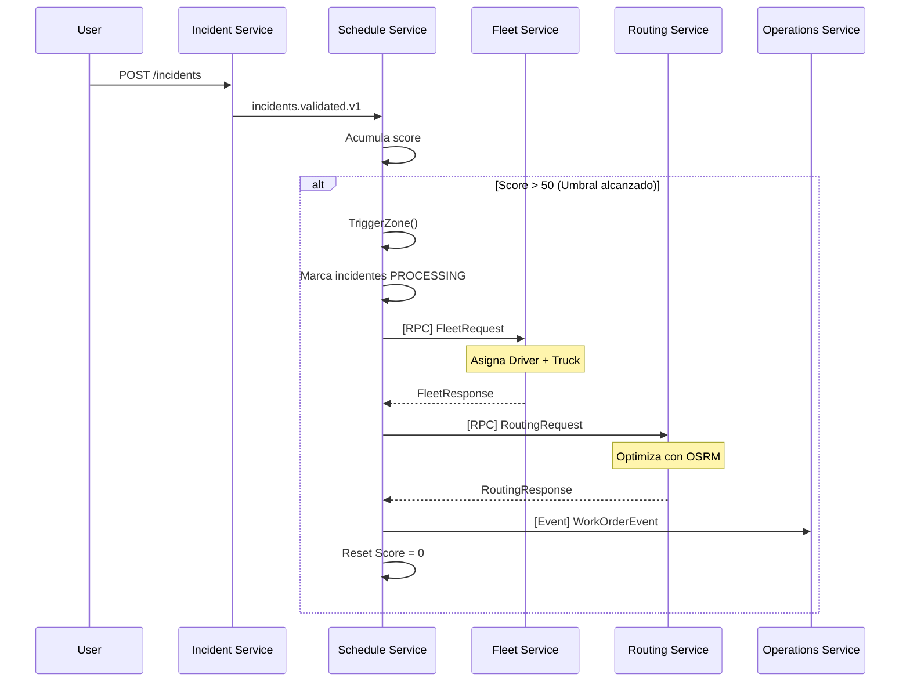
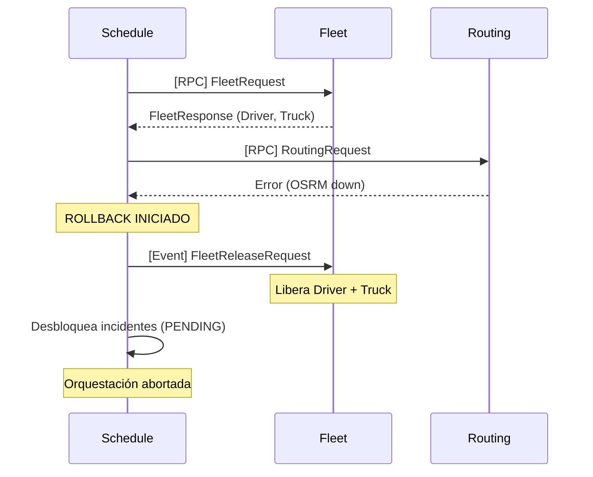

# Implementación RPC Completada - Servicios Integrados

## ✅ Servicios Actualizados

### 1. **Routing Service** ✅

**Archivo**: `routing-service/internal/messaging/rabbitmq.go`

**Nuevo Consumidor RPC**: `ConsumeRPCRequests()`
- **Cola**: `q.routing.rpc`
- **Routing Key**: `routing.optimize`
- **Patrón**: Request-Reply
- **Función**: Optimiza rutas y responde síncronamente

**Flujo**:
```
1. Recibe RoutingRequest con CorrelationId y ReplyTo
2. Valida puntos mínimos (>= 2)
3. Llama a routeService.OptimizeAndSave()
4. Construye RoutingResponse con:
   - polyline (geometría)
   - distance_km
   - duration_min
   - optimized_order
   - waypoint_order (JSON)
5. Publica respuesta a ReplyTo con mismo CorrelationId
```

**Logs Implementados**:
```
📨 [RPC REQUEST] CorrelationId=xxx, ReplyTo=q.scheduler.replies
✅ [RPC RESPONSE] Enviado, Distance=15.06km, Duration=25min
```

---

### 2. **Fleet Service** ✅

**Archivo**: `fleet-service/internal/consumers/fleet_rpc_consumer.go`

**Nuevo Consumidor RPC**: `FleetRPCConsumer`
- **Cola**: `q.fleet.rpc`
- **Routing Keys**:
  - `fleet.resource.request` - Asignación de recursos
  - `fleet.resource.release` - Liberación (compensación)
- **Patrón**: Request-Reply + Fire-and-Forget (compensación)

**DTOs**:
```go
type FleetRequest struct {
    ZoneID       int    `json:"zone_id"`
    RequiredType string `json:"required_type"`
}

type FleetResponse struct {
    DriverID    uuid.UUID  `json:"driver_id"`
    AssistantID *uuid.UUID `json:"assistant_id,omitempty"`
    TruckPlate  string     `json:"truck_plate"`
    Status      string     `json:"status"` // "ALLOCATED"
}

type FleetReleaseRequest struct {
    DriverID   uuid.UUID `json:"driver_id"`
    TruckPlate string    `json:"truck_plate"`
    Reason     string    `json:"reason"`
}
```

**Métodos**:
1. `handleResourceRequest()` - Asigna driver + camión
2. `handleResourceRelease()` - Libera recursos (rollback/compensación)

**Estado Actual**:
- ✅ Estructura RPC completa
- ✅ Manejo de compensaciones
- ⚠️  TODO: Implementar lógica real de asignación (actualmente retorna mocks)
- ⚠️  TODO: Integrar con BD para verificar disponibilidad real

**Logs Implementados**:
```
🚛 Asignando recursos para Zona 2, Tipo: STANDARD
✅ [FLEET RPC RESPONSE] Driver=xxx, Truck=ABC-1234 asignados
🔄 [COMPENSACIÓN] Liberando recursos: Driver=xxx, Truck=ABC-1234, Reason=ROUTING_FAILED
```

---

### 3. **Schedule Service** ✅ (Ya implementado)

**Archivos**:
- `internal/messaging/rpc_client.go` - Cliente RPC
- `internal/service/orchestrator.go` - Orquestador Saga
- `internal/service/orchestrator_adapter.go` - Adaptador
- `internal/models/rpc_dtos.go` - DTOs compartidos

**Cola de Respuestas**: `q.scheduler.replies`

---

## 🔄 Flujo Completo End-to-End

### Escenario: Zona supera umbral (Score > 50)



### Escenario de Fallo: Routing falla



---

## 📡 Configuración RabbitMQ Completa

### Exchanges
```yaml
city.cleaning.planning:
  type: topic
  durable: true
  routing_keys:
    - fleet.resource.request
    - fleet.resource.release
    - routing.optimize
```

### Queues
```yaml
q.scheduler.replies:
  durable: false
  exclusive: false
  auto_delete: false
  description: "Cola de respuestas RPC para schedule-service"

q.routing.rpc:
  durable: true
  exclusive: false
  auto_delete: false
  bindings:
    - exchange: city.cleaning.planning
      routing_key: routing.optimize

q.fleet.rpc:
  durable: true
  exclusive: false
  auto_delete: false
  bindings:
    - exchange: city.cleaning.planning
      routing_key: fleet.resource.request
    - exchange: city.cleaning.planning
      routing_key: fleet.resource.release
```

---

## 🚀 Cómo Probar

### 1. Iniciar Servicios

```bash
# Terminal 1: Routing Service
cd routing-service
go run ./cmd/server/main.go

# Terminal 2: Fleet Service  
cd fleet-service
go run ./cmd/fleet-service/main.go

# Terminal 3: Schedule Service
cd schedule-service
go run ./cmd/server/main.go
```

### 2. Verificar Logs de Inicialización

**Routing Service**:
```
✅ Routing Service iniciado correctamente
👂 Esperando mensajes en cola q.routing.plan-requests...
🔄 Consumidor RPC escuchando en q.routing.rpc (Request-Reply pattern)
```

**Fleet Service**:
```
✓ Fleet RPC Consumer iniciado (Request-Reply pattern)
✓ Conectado a RabbitMQ
```

**Schedule Service**:
```
✅ RPCClient inicializado con cola de respuestas: q.scheduler.replies
🔄 Consumidor de respuestas RPC iniciado
✅ Orchestrator initialized - Saga RPC pattern enabled
```

### 3. Crear Incidentes

```bash
# Crear múltiples incidentes hasta superar umbral
for i in {1..6}; do
  curl -X POST http://localhost:8082/api/v1/incidents \
    -H "Content-Type: application/json" \
    -H "Authorization: Bearer YOUR_TOKEN" \
    -d '{
      "latitude": -0.93'$i',
      "longitude": -78.61'$i',
      "type": "punto_acopio",
      "description": "Test incident '$i'"
    }'
  sleep 2
done
```

### 4. Observar Logs de Orquestación

**Schedule Service**:
```
🚀 [ORCHESTRATOR] Iniciando planificación para Zona 2 (URBANO_NORTE)
🔒 5 incidentes marcados como PROCESSING
📤 FleetRequest enviado: ZoneID=2, CorrelationId=abc-123
✅ FleetResponse recibido: Driver=xxx-yyy, Truck=ABC-1234
📤 RoutingRequest enviado: ZoneID=2, Points=6, CorrelationId=def-456
✅ RoutingResponse recibido: Distance=15.06km, Duration=25min
✅ Work Order publicado: OrderID=zzz
🔄 Score de zona 2 reseteado a 0
🎉 [ORCHESTRATOR] Planificación completada exitosamente
```

**Fleet Service**:
```
📨 [FLEET RPC] RoutingKey=fleet.resource.request, CorrelationId=abc-123
🚛 Asignando recursos para Zona 2, Tipo: STANDARD
✅ [FLEET RPC RESPONSE] Driver=xxx, Truck=ABC-1234 asignados para Zona 2
```

**Routing Service**:
```
📨 [RPC REQUEST] CorrelationId=def-456, ReplyTo=q.scheduler.replies
[INFO] Optimizando ruta para 6 puntos...
📊 [RUTA OPTIMIZADA] Zona 2 - Orden de visita: [0 4 1 3 2 5]
   📏 Distancia total: 15062.50 metros (15.06 km)
   ⏱️  Duración estimada: 1491.70 segundos (24.9 minutos)
✅ [RPC RESPONSE] Enviado a q.scheduler.replies, Distance=15.06km, Duration=25min
```

---

## ⚠️ Trabajo Pendiente

### Fleet Service
- [ ] Implementar lógica real de asignación de drivers
- [ ] Consultar BD para verificar disponibilidad de camiones
- [ ] Implementar algoritmo de asignación por zona/proximidad
- [ ] Guardar registro de asignaciones en BD
- [ ] Manejar casos de no disponibilidad (sin drivers/trucks libres)

### Operations Service
- [ ] Crear consumidor para `workorder.created`
- [ ] Guardar Work Orders en BD
- [ ] Notificar a drivers asignados
- [ ] Actualizar estado de Work Orders

### Testing
- [ ] Pruebas unitarias para RPC consumers
- [ ] Pruebas de integración end-to-end
- [ ] Pruebas de fallo y compensaciones
- [ ] Pruebas de timeout (10s)
- [ ] Pruebas de carga/concurrencia

### Observabilidad
- [ ] Métricas de latencia RPC
- [ ] Contador de compensaciones
- [ ] Tracing distribuido (Jaeger/Zipkin)
- [ ] Dashboards de Grafana

---

## 📚 Referencias

- [Patrón Saga Orquestado](https://microservices.io/patterns/data/saga.html)
- [RabbitMQ RPC Tutorial](https://www.rabbitmq.com/tutorials/tutorial-six-go.html)
- [Request-Reply Pattern](https://www.enterpriseintegrationpatterns.com/patterns/messaging/RequestReply.html)
- [Compensating Transaction Pattern](https://docs.microsoft.com/en-us/azure/architecture/patterns/compensating-transaction)
